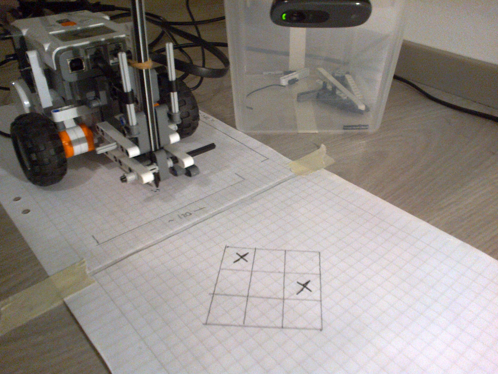

Tämä on joulun 2014 robottikurssin loppuraportti. Luettavin versio on [pdf](loppuraportti.pdf).

# Ristinollarobotin kuvaus

Ristinollarobotti on ristinollaa web-kameran avulla pelaava Lego Mindstorms -robotti.

Robotti koostuu varsinaisesta piirtorobotista (`PenBot`) ja erillisestä tietokoneella (= kannettava tietokone) ajettavasta varsinaisesta peliohjelmasta (`BotGame`). Ohjelmointikieli on molemmissa Java (piirtobotissa [LeJOS](https://www.lejos.org)), ja kuvantunnistukseen käytetään [OpenCV](http://opencv.org/):n Java-API:ia.

Peliohjelma osaa tunnistaa ulkoisen web-kameran avulla paperille piirretyn pelilaudan ja pelaajien (robotti ja sen vastustaja) sille piirtämät merkit, ja tämän avulla pelata ristinollaa ihmisvastustajaa vastaan. Peliohjelma lähettää tekoälyn valitsemat siirrot Bluetoothin yli piirtorobotille, jolla on valmiit rutiinit ruksin piirtämiseksi kuhunkin ruutuun.

# Robotin rakenne ja toiminta

## Materiaalit ja tarvikkeet

Robotin toteuttamiseen käytettiin

* (hieman vajaa) Lego Mindstorms NXT -sarja
    * NXT Brick, kolme moottoria
    * sekalaisia Mindstorms -legoja
    * (NXT:n omia sensoreita ei tarvittu / käytetty)
* Web-kamera: Logitech C270
* Tussikynä: Stabilo Pen 68
* Kannettava tietokone jossa Bluetooth
* Kuminauhaa, paperia, teippiä, korotettu alusta kameralle

## Piirtobotti

### Strategiset mitat

* Renkaiden välinen etäisyys ~120 mm
* Etäisyys keulasta perään ~210 mm
* Säkäkorkeus ~75 mm
* Kynän kärjen etäisyys akselista piirtoasennossa ~70 mm

### Rakenne

Piirtobotin perusrunko perustuu NXTPrograms.com [3-Motor Chassis](http://nxtprograms.com/3-motor_chassis/index.html) -rakenteeseen, jota jouduttiin hieman muokkaamaan osien puutteesta johtuen (esim. samanlaista rullapyörää ei ollut käytettävissä, joten piti soveltaa) ja johon lisättiin ylös ja alas liikkuva kynä.

Rakenteeltaan robotti on kahden moottorin avulla liikkuva auto, joka pystyy kääntymään säätelemällä vasemman ja oikeaan pyörän moottoreiden pyörimisnopeutta. Pyörittämällä moottoreita samalla nopeudella eri suuntiin robotti pystyy kääntymään paikoillaan renkaiden välisen kuvaannollisen 'akselin' keskipisteen ympäri.

Koska ns. rullapyöräksi sopivia pieniä renkaita ei ollut mukana allekirjoittaneelle päätyneessä sarjassa, ja käytettävissä olevien suurehkojen kumipyörien sijoittaminen perusrunkoon osoittautui varsin haastavaksi (kumirenkaan kanssa pyörät olivat aivan liian suuria ja ilman kumiosaa sylinterimäisten pyörien liike oli liian tökkivää piirtämiseen), robotissa ei ole tukena tällaisessa Lego-autossa tavanomaista rullapyörää (*castor wheel*), vaan yksinkertainen pyödän pintaa pitkin liukuva tuki.

Kynän liikuttelumekanismi käyttää kolmatta moottoria kynän nostamiseen ja laskemiseen paperille piirtämistä varten. Käytännössä kynä on kiinnitetty kumilenkillä telineeseen, jonka liike on rajoitettu ylös-alas -suuntaiseksi kiskojen avulla; telineeseen on kiinnitetty tapit, joiden avulla moottoriin kiinnitetyt varret voivat painaa kynän alas tai kohottaa sen ylös. Lisäksi kynän edessä ja takana on kynän heilumista rajoittavat tuet, jotka pitävät kynän tukevasti paikoillaan piirtämisen aikana.

[Video kynän liikuttelumekanismin toiminnasta.](https://drive.google.com/file/d/0B1_61yv8HENsbnNzMTUzMGl3d3c/view?usp=sharing)

Kumilenkkikiinnitys mahdollistaa teoriassa pienen hätävaran siltä varalta että käyttäjä menee ja poistaa turvarajat PenBotin ohjelmakoodista ja kalibroi moottorin väärin: jos moottori yrittäisi painaa kynää alemmas kuin turvalliseen käyttöön on suunniteltu, kumilenkit teoriassa joustaisivat sen sijaan että moottoriin tai rakenteeseen kohdistuisi haitallista rasitusta. (Robotin toiminta voidaan myös välittömästi keskeyttää hätäseis-nappulaa painamalla.)

Lisäksi kynän vierässä on pieni työkalu, joka helpottaa robotin asettamista oikeaan suuntaan ruutupaperin päälle.

Varsinaisen erillisen rakennusohjeen sijasta lukijaa pyydetään seuraamaan NXTPrograms.com:n [ohjeen](http://nxtprograms.com/3-motor_chassis/steps.html) vaiheita 1 -- 4 ja 12 --, ja vertailemaan eroavaisuuksien kohdalla alla oleviin kuviin. Huom. erityisesti että rullapyörän korvaavan tuen kiinnitys on erilainen.

### Ruksin piirtäminen

Robotti osaa piirtää pelilaudalle ruksin edestakaisella liikkeellä ja sivusuuntaisilla käännöksillä.

[Video: Robotti piirtää yhden ruksin.](https://drive.google.com/file/d/0B1_61yv8HENsd2xyX05UbkxOV28/view?usp=sharing)

[Video: Robotti piirtää toisen ruksin.](https://drive.google.com/file/d/0B1_61yv8HENsbF9YTGVja3RDVHc/view?usp=sharing)

[Video: Väärin suunnattu robotti piirtää ruksin hieman sivuun ruudun keskipisteestä.](https://drive.google.com/file/d/0B1_61yv8HENsVWVyTVQ1ZlVLMGs/view?usp=sharing)

## Kamera ja kuvantunnistus

### Kameran sijoittaminen

Ristinollapelikentän näkevä kamera on sijoitettu (perästä päin katsoen) robotin vasemmalle puolelle noin 15 cm korkealle alustalle. `BotGame`:n kuvankäsittelyrutiinit osaavat tehdä kameran kuvalle perspektiivikorjauksen, mutta tunnistuksen luotettavuuden kannalta on suotavaa että kuva peliruudukosta ei ole liiaksi vääristynyt. Erityisesti vaaditaan että kameran näköpiirissä on mahdollisimman muita mahdollisesti pysty- tai vaakasuuntaisilta viivoilta näyttäviä kohteita (paperin reuna, varjot, jne) jotka saattavat erehdyttää `BotGame`:n pelialueen hahmotusmetodeja.

### Kuvantunnistuksen toimintaidea

Kuvantunnistusmenetelmän pääinspiraationa oli [AI Shackin Sudoku-lukija](http://aishack.in/tutorials/sudoku-grabber-with-opencv-plot/), jota tosin on sovellettu varsin paljon. Menetelmän idea on yleisellä tasolla seuraava:

1. Ensin etsitään taustakuva, johon mahdollisia muutoksia verrataan:
2. Muunnetaan kuva harmaasävykuvaksi.
3. Ruutupaperin ruutujen häivyttämiseksi sumennetaan kuvaa Gauss-sumennoksella, jonka jälkeen tehdään harmaasävykuvasta mustavalkoinen muuttamalla  ([adaptive threshold](https://en.wikipedia.org/wiki/Thresholding_%28image_processing%29)), jolloin kuvaan jää jäljelle vain pääasiassa merkitseviä viivoja ja merkkejä. Tämän 'binäärikuvan' värit käännetään jatkoa varten.
4. Aiemmassa vaiheessa jotkut tärkeätkin ruudukon viivat saattavat 'katketa', joten niitä yritetään palauttaa morphologisella sulkemisella ([morphological closing](https://en.wikipedia.org/wiki/Closing_%28morphology%29)).
5. Näin käsitellystä kuvasta etsitään [Hough-muunnoksella](https://en.wikipedia.org/wiki/Hough_transform) kaikki viivat.
6. Koska OpenCV:n Hough-rutiini löytää sellaisilla parametreilla joilla varmasti saadaan kaikki *tärkeät* viivat myös *paljon* viivoja jokaista pelilaudan oikeaa viivaa kohti, lähellä toisiaan olevien viivojen parvet yhdistetään yhdeksi viivaksi per parvi (keskiarvo).
7. Yhdistetyistä viivoista etsitään äärimmäiset (tietyn marginaalin puitteissa) vaaka- ja pystyviivat, jotka vastaavat pelilaudan reunoja. Näiden leikkauspisteet (= peliruudukon nurkat) lasketaan.
8. Leikkauspisteiden avulla kuvan perspektiivi korjataan ja se jaetaan 3x3 -ruudukoksi. Kunkin ruudun reunoista  'leikataan pois' pieni kaistale (jotka sisältävät piirretyn ruudukon viivat)  ja (alkutilanteessa tyhjä) sisäalue ja sen histogrammi talletetaan.
9. Jokaiselle verrattavalle kuvalle tehdään sama prosessi, ja kuvien vastaavia alueille verrataan toisiinsa. Mikäli jonkin solun histogrammeissa peruskuvan ja verrattavan välillä on suuri ero, todetaan että tähän ruutuun on verrattavassa kuvassa piirretty uusi merkki.
10. Mikäli havaittu merkki hyväksytään oikein luetuksi siirroksi, se päivitetään uudeksi peruskuvaksi seuraavan siirron lukemista varten.

# Ohjelmakoodi

## Penbot

## BotGame

# Testaus

Kaikkea mitä olisi voinut testata, ei tullut testattua. Erityisesti matematiikkametodeja ja kuvanhahmotustoimintaa varten olisi voinut kirjoittaa suoranaisia yksikkötestejä esim. JUnitilla.

Käytännössä robotin kehittäminen oli iteratiivinen prosessi: "testataan toimiiko jokin toiminnallisuus näin" -> "korjataan kunnes toimii" -> "kun toimii, lisätään toiminnallisuus". Valitettavasti tälläisestä epä-TDD 'patternista' ei jäänyt hirveästi varsinaista testikoodia.

## Ohjelmallisia testi'skriptejä'

Eri toiminnallisuuksien kokeilemista ja säätöä varten on ohjelmissa erityisen `test`-paketin luokissa muutama `main`-metodeja, joita ajamalla varsinaisen `main`:n sijaan voi testata robotin eri toiminnallisuuksien toimintaa.

### PenBotin kynänliikuttelun testaus ja säätö

`PenBot`: n `test.PenConfigureTest` sisältää testin kynän kalibrointirutiinille, jonka avulla voi kokeilla yleisesti kynänliikuttelun toimivuutta ("liikkuuko kynä oikein? piirtääkö se jäljen paperille?").

Lisäksi `PenConfigureTest` mahdollisti piirtobotin kynänliikuttelun ohjelmallisten turvarajojen testaamisen. Tulos: turvarajat toimivat, kalibrointiskriptin (= normaali käyttö) avulla bottia ei saatu kääntämään kynämoottoria yli 20 astetta alaspäin, joka oli todettu vielä täysin turvalliseksi asennoksi.

### Kuvanhahmotuksen testaus ja säätö

`BotGame`:n `test.BoardReaderCamTest`:ia voi käyttää web-kameran kuvankaappauksen toiminnan testaamiseen ("havaitseeko kuvantunnistusmenetelmä ruudukkoon piirretyn uuden X- tai O-merkin oikein?") käynnistämättä varsinaista pelirutiinia. Esimerkiksi tarkistin ennen demotilaisuutta että kuvankäsittelymetodit toimivat myös yliopiston tiloissa, joiden valaistus.

Vastaavankaltaista koodinpätkää käytettiin merkintunnistustoiminnallisuutta koodatessa myös eri raja-arvojen ja kuvaruutujen vertailumenetelmien tutkimiseen. Lopulta päädyttiin koodin tämänhetkisessä versiossa oleviin vakioihin ja metodeihin.

### Käskyjen välittäminen tietokoneelta PenBotille ja piirtäminen

Bluetooth-kommunikaation testaamista varten on erillinen komentoriviohjelma `BotCommander`, jonka avulla käyttäjä voi suoraan komentoriviltä käskyttämällä lähettää viestintäprotokollan mukaisia komentoja `PenBot`:ille.

`BotCommanderin` avulla tehtiin seuraavat testit:

1. Bluetooth-yhteyden muodostaminen ja `Input/OutputStream`:n avaaminen `PenBotin` ja `BotCommanderin ` välillä onnistuu.

2. `PenBot` vastaanottaa ja lukee Bluetoothin kautta lähetettyjä käskybittejä onnistuneesti.

3. `PenBot` suorittaa käskyn mukaisen komennon oikein (piirtää ruksin oikeaan koordinaattiin).

## Testibotit

Varsinaisen `PenBot`-ohjelman lisäksi jäljelle jäi pari pientä 'testibottia' jotka voitiin myös ladata Lego-robotin brickille LeJOS:n yms. eri ominaisuuksien testaamiseksi.

### Hello Ironman!

Käytettiin testaamaan toimiiko yksinkertaisen "hello world" -ohjelman kääntäminnen ja lataaminen robottiin eri ympäristöissä ja  yhteysmenetelmillä. Jouduttiin mm. toteamaan että Ubuntun ajureilla ei saanut toimivaa USB-yhteyttä Lego-robottiin.

### Hello BT!

Testattiin viestibittien vastaanottamisen lisäksi myös lähettämistä robotilta tietokoneelle, mutta tätä ominaisuutta ei sitten varsinaisessa pelirobotin toteutuksessa hyödynnetty.

## Muita testiskenaarioita

### Hätäpysäytys

`PenBot`:iin asetettua vaadittua hatäpysäytystoiminnallisuutta testattiin painamalla kesken ohjelman suorituksen pysäytysnapiksi valittua `ESCAPE`-nappulaa. Hätäpysäytys toimi. [Video testistä](https://drive.google.com/file/d/0B1_61yv8HENsY3EtOFNwVTdfUzg/view?usp=sharing)

# Rajoitukset ja tulevaisuus

## Toteuttamatta jääneet ominaisuudet

Robotti jäi kahdelta osin hieman keskeneräiseksi:

Ensinnäkin, peli ei osaa pelata ristinollaa täysin itsenäisesti, sillä `BotGame`:n hahmontunnistuskoodi ei osaa hylätä sellaisia webkameran kuvia, joissa pelilaudan ja kameran välissä on este (esimerkiksi ihmispelaajan käsi tai piirtorobotti itse). Ohjelmasta puuttuu myös botin piirtämien merkkien tunnistus kameran kuvasta AI:n omiksi siirroiksi. Tämän vuoksi peli pyytää käyttäjältä vahvistuksen jokaiselle pelilaudalla havaitulle muutokselle esittääkö se botin tai pelaajan tekemää siirtoa.

Toiseksi varsinainen tekoäly puuttuu. Robotti pelaa ristinollaa sääntöjen mukaan, muttei erityisen älykkäästi.

Molemmat ongelmat olisi ollut tarkoitus ratkaista: Ristinollatekoälyn toteutus jonkinlaisella minimax-algoritmilla tai alpha-beta -karsinnalla olisi melko triviaali tehtävä. Kameran eteen tulleen esteen kaltaiset huomattavat muutokset kuvassa puolestaan olisi (ainakin teoriassa) yksinkertaista havaita OpenCV:n avulla.

Esimerkiksi eräs vaihtoehto tähän olisi tarkastella värikuvan histogrammin poikkeamia (pelilautaa esittävään kuvaan nähden) kun laudan päällä on robotin tai käden kaltainen 'ylimääräinen' esine. Oletettavasti histogrammissa nähtäisiin suuri poikkeama verrattuna tilanteeseen, jossa ainoa muutos on peliruutuun ilmestynyt pieni merkki.

Botti-tekoälyn tekemät siirrot vuorostaan olisi luultavasti mahdollista tunnistaa (ja ohittaa kysymättä pelaajan vahvistusta) hieman ohjelmakoodia laajentamalla.

##Muita puutteita ja rajoitteita:

Piirtorobotti ei osaa asemoida itseään pelilautaan nähden. Käyttäjän on sijoitettava robotti ennaltavalittuun asentoon peliruudukkoon nähden (pelilaudan lävistäjän kautta kulkevalle suoralle). Mikäli robotti on hieman vinossa, se myös ajaa hieman sivuun ja pahimmassa tapauksessa piirtää ristejä vääriin paikkoihin. Ongelmaa voisi hieman helpottaa laajentamalla nykyistä toiminnallisuutta pienellä kalibrointiskriptillä (robotti kulkisi edestakaisin ja piirtäisi pisteitä sinne missä se kuvittelee esim. peliruudukon nurkkien olevan; käyttäjä voisi korjata robotin asentoa).

Piirtorobotti nykyisessä muodossaan piirtää kulkemalla edestakaisin ja pyörimällä moottoriakselinsa keskipisteen suhteen; toisin sanoen vaakasuuntainen viiva on kaareva. Tämän vuoksi mahdolliset kuviot käytännössä ovat ruksien ja pisteiden kaltaisia yksinkertaisia kuvioita, joita tämä rajoitus ei haittaa. Ristinollan perinteisen 'nolla'-kuvion piirtäminen olisi nykyisellä rakenteella melko vaikeaa.

Kuvan analysointimenetelmät ovat teoriatasolla yleistettävissä, mutta koodissa käytetyt vakiot, raja-arvot, jne. on löydetty käsin kokeilemalla tietynlaisella kamerakokoonpanolla. Esimerkiksi huomasin että tutkittavien kuvien resoluution vaihtaminen voi rikkoa nykyisen toiminnallisuuden.

# Käyttöohjeet

## Ohjelmistojen kääntäminen ja lataaminen NXT:lle

### PenBot

Tarvitaan:

* LeJOS 0.9.1 (omine vaatimuksineen, ts. tuore JDK); LeJOS täytyy kirjoittaa Legon oman firmwaren päälle NXT-brickille (LeJOS:in omien ohjeiden mukaisesti).
* Uusin Ant.
* Toimiva Bluetooth- tai USB-yhteys kääntöympäristön ja NXT:n välillä.

Koodin mukana tulee LeJOS:in käyttöesimerkkien mukainen Ant-skripti. Aja esim. `ant uploadandrun` kansiossa `PenBot`.

Kääntäminen toimii ainakin Ubuntu 14.10:llä, mutta todennäköisesti onnistuu myös Windows / Mac OS. (Ei kokeiltu.)

### BotGame

* Edellisten lisäksi LeJOS tarvitsemat OS-natiivit Bluetooth-kirjastot (seuraa LeJOS:in asennusohjeita).
* OpenCV 2.4.4+ (toimii ainakin 2.4.9.0.) vaatimuksineen. Käännä OpenCV:n kirjastot asennusohjeiden mukaisesti.

BotGamea varten ei ole kätevää Ant-skriptiä; sen sijaan GitHubissa on valmis Eclipse-projekti, johon täytyy linkata vaaditut LeJOS- ja OpenCV-kirjastot.

## Pelaaminen

Pelitoiminnallisuus on edelleen hieman raakile.

Olettaen että `PenBot`:n lähdekoodiin on kirjoitettu oikeat pelialueen ja robotin mitat (robotin etäisyys ruudukosta, ruutujen koko, robotin mitat):

1. Aseta `PenBot` oikealle etäisyydelle (säädä lähdekoodia) ruudukosta, tarkalleen ruudukon lävistäjän kautta kulkevalle suoralle (ks kuvat), ja kohdista web-kamera.
2. Käynnistä `PenBot` NXT:llä. Näytölle ilmestyy teksti `I AM IRONMAN`. Paina mitä tahansa näppäintä paitsi harmaa `ESCAPE` (joka keskeyttää ohjelman toiminnan).
3. `PenBot` siirtyy kynän kalibrointitilaan. Säädä kynämoottorin kääntökulma nuolinäppäimillä niin että kynä piirtää selkeän jäljen paperille, ja paina oranssi `ENTER`.
4. Näytölle ilmestyy teksti `WAITING FOR CONNECTION`. Käynnistä `BotGame` (tai `BotCommander`).
5. Kun yhteys on luotu, `BotGame` tulostaa stdout:iin `Connected!` ja pyytää tarkistamaan webkameran asennon. Tätä varten aukeaa ikkuna web-kameran näkymästä. Kun kamera on kohdallaan, paina rivinvaihtoa. Tämän jälkeen `BotGame` yrittää etsiä kameran kuvasta ruudukon, ja onnistuessaan tulostaa lyötämänsä ääriviivat.
6. `PenBot` puolestaan ilmoittaa että se on valmis kommunikoimaan `BotGame`:n kanssa viestillä `READY TO READ`: paina taas jotain NXT:n näppäintä.
7. Paina rivinvaihtoa; `BotGame` aloittaa pelin.
8. Konsoliin tulostuu `BotGame`:n tekemä siirto ja `PenBot` piirtää sen. Mikäli kamera toimii, se pienen viiveen jälkeen (jonka aikana robotti ehtii toivottavasti ajaa pois kameran edestä) havaitsee laudalla muutoksen ja kysyy onko se robotin vai pelajaan merkki (vai virheellinen havainto). Vastaa `bot` jos havaittu siirto on oikea (tarkista suorituskansioon tulostetut debug-kuvat) tai `no` jos robotti ei ehtinyt alta pois.
9. Tee oma siirtosi. Merkin havaittuaan `BotGame`:n pitäisi jälleen kysyä kenen se on; vastaa jälleen. `BotGame` tulostaa konsoliin missä se mielestään näki symbolisi.
10. Robotti vastaa omalla siirrollaan. Jatketaan samaan tapaan, kunnes jompi kumpi on voittanut pelin (jolloin robotti ilmoitta kumpi voitti, ja lopettaa).
